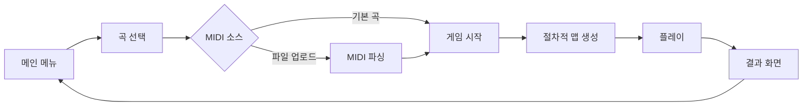

# 🎵 RhythmOdyssey - 게임 기획서 v1.0

> **음악 반응형 절차적 생성 러닝 게임**  
> 음악을 시각적 공간으로 탐험하는 인터랙티브 웹 게임

---

## 1. 게임 개요

### 컨셉

- **장르**: 리듬 액션 러너 (쿠키런 스타일)
- **플랫폼**: 웹 브라우저 (PC/모바일)
- **핵심 특징**: MIDI 데이터 기반 절차적 맵 생성

### 핵심 경험

- 음악의 멜로디가 지형이 되고, 리듬이 장애물이 되는 세계를 달린다
- 설치 없이 브라우저에서 즉시 플레이 가능
- 사용자 MIDI 파일 업로드로 무한한 스테이지 생성

---

## 2. 기술 스택

| 분야 | 기술 | 용도 |
|------|------|------|
| 3D 렌더링 | **Three.js** | 로우폴리곤 그래픽, 절차적 메쉬 생성 |
| 오디오 | **Tone.js + @tonejs/midi** | MIDI 파싱, 오디오 스케줄링 |
| 언어 | **JavaScript (ES6+)** | 게임 로직 전체 |

---

---

## 3. 핵심 게임 시스템 및 규칙

본 게임은 **"음악의 박자에 맞춰 장애물을 피하는"** 리듬 러너 게임입니다.

### 3.1 판정의 핵심: Hit Zone (판정선)

- **위치**: 화면 좌측, 플레이어 캐릭터가 위치한 수직 네온 라인 (`X = -3.0`).
- **규칙**: 모든 장애물은 오른쪽에서 왼쪽으로 이동하며, **장애물이 판정선을 완전히 지나가기 전에** 올바른 회피 동작을 완료해야 합니다.

### 3.2 장애물 종류 및 대응 동작 (Action-Response)

| 오브젝트 | 시각적 형태 | 리듬 소스 (MIDI) | 대응 조작 (PC) | 성공 조건 |
| :--- | :--- | :--- | :--- | :--- |
| **RED SPIKE** | 빨간색 바닥 가시 | Kick Drum | **Space** (점프) | 가시가 판정선을 통과할 때 **공중에 떠 있어야 함** |
| **BLUE BAR** | 파란색 공중 막대 | Snare/Clap | **Down** (슬라이딩) | 막대가 판정선을 통과할 때 **슬라이딩 중이어야 함** |
| **GOLD GEM** | 회전하는 황금 보석 | Hi-Hat | 자동 획득 | 보석과 플레이어 캐릭터가 접촉 시 획득 |

### 3.3 판정 등급 (Judgment Level)

장애물이 판정선의 **정중앙(음악의 정박)**에 얼마나 가까울 때 동작을 시작했는지(또는 상태를 유지했는지)에 따라 결정됩니다.

- **PERFECT**: 박자와의 오차 ±120ms 이내. 가장 높은 점수.
- **GREAT**: 박자와의 오차 ±220ms 이내.
- **GOOD**: 박자와의 오차 ±350ms 이내. (또는 통과 시점에 상태만 유지 중일 때)
- **MISS**: 회피 동작을 하지 않았거나, 너무 늦게/일찍 조작하여 피격됨. (HP 감소)

---

### 3.2 캐릭터 시스템

#### 동적 속성

- **BPM 동기화**: 달리기 애니메이션 속도 = 곡의 BPM
- **Velocity 반응**: 강한 타건 → 캐릭터 거대화, 파티클 강화
- **파츠 조합**: 템포/장르에 따른 절차적 캐릭터 조합

---

## 4. 기술적 도전과 해결책

### 4.1 오디오 레이턴시 해결

> [!IMPORTANT]
> 리듬 게임의 핵심은 **정확한 동기화**

- **Look-ahead 스케줄링**: 음악 재생 시점보다 2~4초 먼저 시각 요소 생성
- **AudioContext.currentTime 기준**: requestAnimationFrame 대신 Web Audio API 타이밍 사용
- **오프셋 보정(Calibration)**: 사용자 기기별 싱크 조정 기능 필수 제공

### 4.2 저작권 대응

- 사용자 MIDI: 로컬 처리만 (서버 저장 X)
- 기본 음악: 퍼블릭 도메인/CC 라이선스 음원 활용

---

## 5. 게임 흐름

---

## 6. 조작법

| 입력 | PC | 모바일 | 동작 |
|------|-----|--------|------|
| 점프 | Space / ↑ | 화면 상단 탭 | 높이 뛰기 |
| 슬라이드 | ↓ | 화면 하단 스와이프 | 낮게 슬라이딩 |

---

## 7. 개발 로드맵 (MVP)

| 단계 | 목표 | 산출물 |
|------|------|--------|
| **Step 1** | MIDI 재생 + 이벤트 로깅 | 콘솔 로그 출력 |
| **Step 2** | Three.js 연동, 노트 시각화 | 큐브 생성 데모 |
| **Step 3** | 플레이어 + 충돌 처리 | 플레이 가능한 프로토타입 |
| **Step 4** | 로우폴리 에셋 + 분위기 변환 | 완성된 MVP |

---

## 8. 참고 자료

- **Three.js**: <https://threejs.org/>
- **Tone.js**: <https://tonejs.github.io/>
- **@tonejs/midi**: <https://github.com/Tonejs/Midi>
- **Public Domain MIDI**: <https://www.kunstderfuge.com/>
